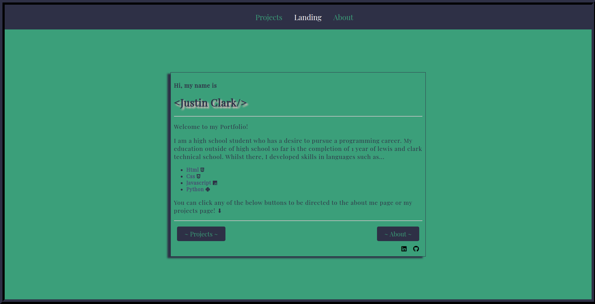

# Justin Clark's Portfolio

## Front page preview


## Code

```html
<div class="container">

    <div class="centerContainer">

        <h3>Hi, my name is</h3>
        <h1>&lt;Justin Clark/&gt;</h1>
        <hr/>

        <p>Welcome to my Portfolio! </p><p> I am a high school student who 
            has a desire to pursue a programming career. My education outside
            of high school so far is the completion of 1 year of lewis and clark technical school. 
            Whilst there, I developed skills in languages such as...</p>
        <ul>
            <li><b>Html</b> <i class="fab fa-html5" id="html"></i></li>
            <li><b>Css</b> <i class="fab fa-css3-alt" id="css"></i></li>
            <li><b>Javascript</b> <i class="fab fa-js" id="js"></i></li>
            <li><b>Python</b> <i class="fab fa-python" id="python"></i></li>
        </ul>

        <p>You can click any of the below buttons to be directed to the about me page
            or my projects page! &#11015;</p>

        <hr/>

        <div class="bottomButtons">
            <button type="submit"><a href="./projects.html">~ Projects ~</a></button>
            <button id="second" type="submit"><a href="./about.html">~ About ~</a></button>
        </div>

        <a href="https://github.com/Justin-Clark" target="_blank"><i class="fab fa-github icons"></i></a>
        
        <a href="https://www.linkedin.com/in/justin-clark-913a281a9/" target="_blank">
          <i class="fab fa-linkedin icons"></i></a>
      
    </div>
</div>
```
